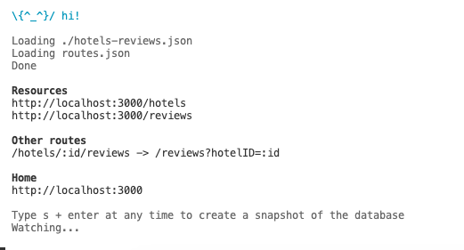
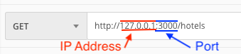
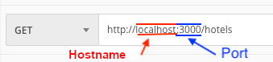
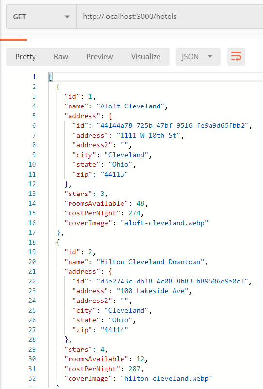
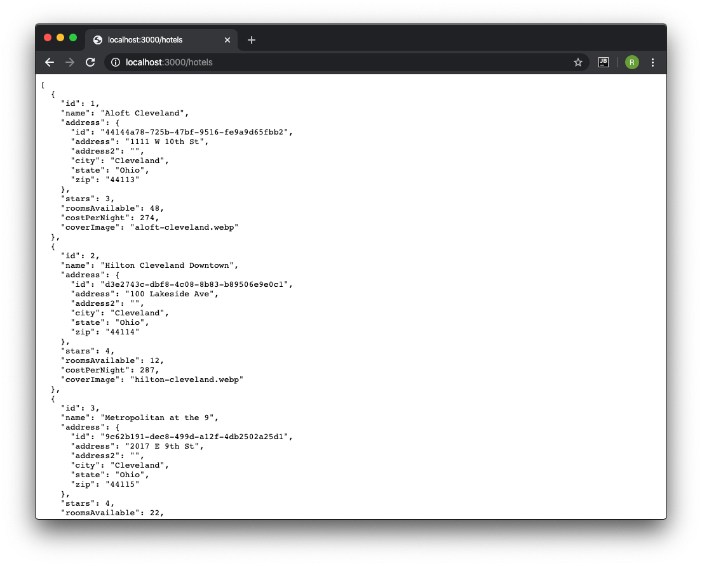
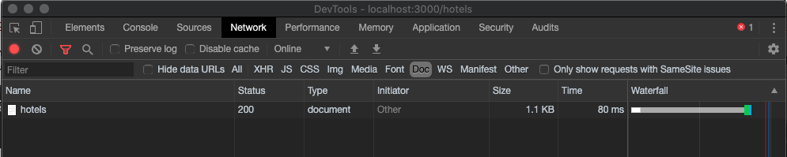
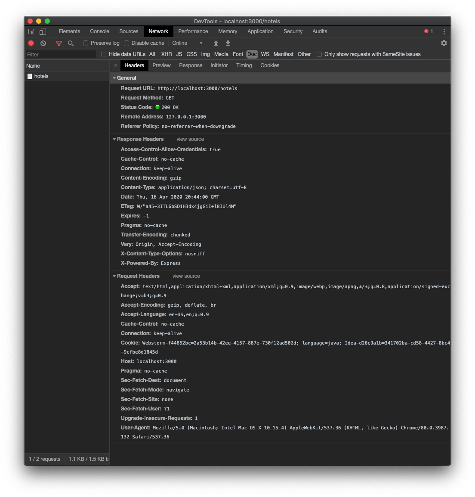
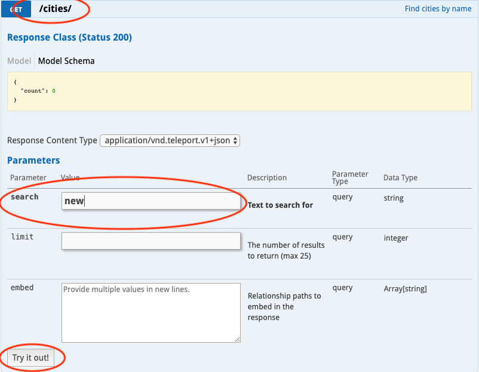
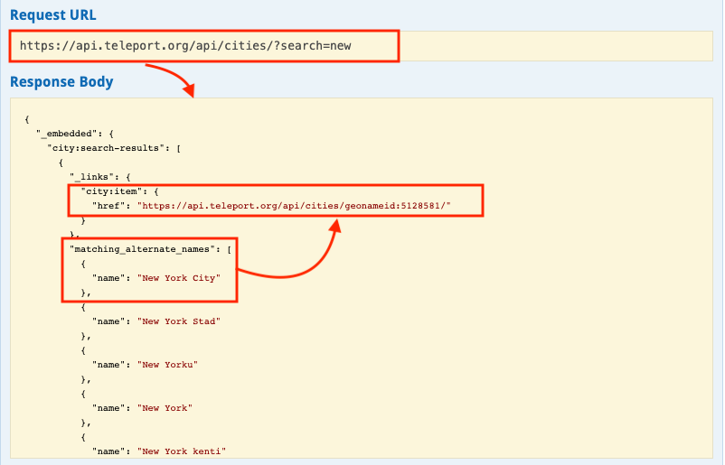
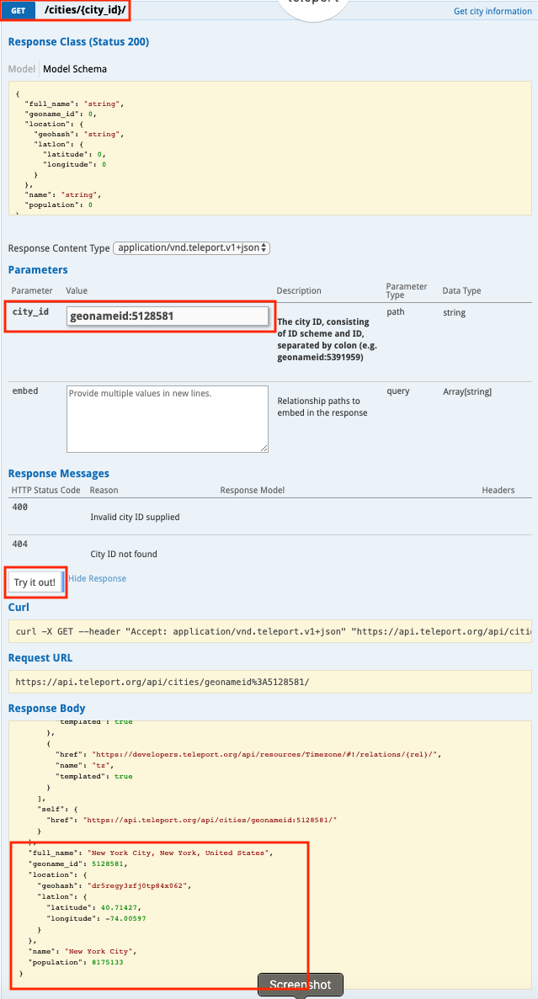

# Lecture code walkthrough

## Before you begin

You'll retrieve a list of hotels and specifics from an HTTP server in today's lecture. You'll use Postman, the Chrome Developer tools, and the IDE. By now, the students are familiar with Postman. They may not know how to use the Network tab in the Chrome Developer Tools to review requests and responses. The tutorial code is similar to the code in this lecture to emphasize the "what and why" rather than the "how."

This walkthrough provides many opportunities to cover the specifics listed in the learning objectives while not covering every aspect. 

#### Start the server

Start the server first. Open a terminal in the `server` folder and run `npm install; npm start`. The application starts up and is available at `http://localhost:3000/`. The console looks like this:



## IP versus hostname

Take some time to discuss the differences between IP address and host names.

IP Address:



Hostname:



Next, take this opportunity to explain the purpose of:

* IP Addresses
* DNS
* Ports
* HTTP
* TLS (HTTPS)

## Postman

You don't need to discuss the details of what Postman offers—they learn about this in the tutorial. The focus here should be on using the tool to discuss the overarching learning objects.

Open Postman and navigate to `http://localhost:3000/hotels` and explore the JSON that's returned from the server.




> Consider making a request that generates a 404 (http://localhost:3000/hotels/200) and explain the various status codes they may encounter. Be aware the server returns an empty object (`{}`) as the response body with the correct response code of `404`.

## Chrome and Chrome developer tools

Open Chrome and navigate to `http://localhost:3000/hotels`.

Point out that typing a URL into the address bar of the browser and pressing enter creates a `GET` request for content at that URL. For a Web API endpoint, a `GET` request that returns JSON is displayed in the browser.



This provides the opportunity to introduce a different tool. Open the developer tools and use the network tab to show the students the same details discussed with Postman.

Start by pointing out the requested resource line. Then point out the HTTP status code column for the request:



Expand the request to show the sub-tabs for that request. Show the students the request and response headers. 

Afterwards, describe the process of the request. Make sure to point out that the Preview and Response tabs contain the Response Body.



## Coding a console application to make a GET request

You'll code a console application that `GET`s a list of hotels, a specific hotel, and apply various query parameters to return a filtered list of hotels or reviews. If you have time, you should consider requests with other filtering criteria.

The starting code provides code for printing a list of hotels and a list of reviews. This allows you to use both hotels and reviews endpoints directly. It also allows you to filter hotels and reviews or print reviews for a specific hotel.

#### Available endpoints

* GET - http://localhost:3000/hotels
    - A list of _all_ hotels are returned with the following structure:
    ```js
    {
        "id": 1,
        "name": "Aloft Cleveland",
        "address": {
            "id": "69006b81-7f58-4acc-a10e-f9f87affae5f",
            "address": "1111 W 10th St",
            "address2": "",
            "city": "Cleveland",
            "state": "Ohio",
            "zip": "44113"
        },
        "stars": 3,
        "roomsAvailable": 48,
        "costPerNight": 274,
        "coverImage": "aloft-cleveland.webp"
    }
    ```

* GET - http://localhost:3000/reviews
    - A list of _all_ reviews with the following structure
    ```js
    {
        "hotelId": 1,
        "title": "What a great hotel!",
        "review": "I thought this was a really great hotel and would stay again!",
        "author": "John Smith",
        "stars": 4
    }
    ```

* GET - http://localhost:3000/hotels/1/reviews
    - A list of reviews for the given hotel id

In addition, query parameters for any of the Hotel and Review properties are available. Examples include:
 * http://localhost:3000/hotels?stars=3
 * http://localhost:3000/hotels?address.city=Cleveland
 * http://localhost:3000/reviews?hotelId=1

#### Public API endpoints

You'll also access a public API to show `GET` requests. You're encouraged to use the public API at Teleport.org. 

The demonstration use case has you consider an auto-filling (type ahead) HTML `<input>` element where a user would enter a few letters of a city. 

In turn, the API is called to retrieve a list of city names (the demonstration). Finally, show the students the specific city ID in the results. Then use the ID to query for the city.

* **Step 1:** Navigate to the [Teleport Public API](https://developers.teleport.org/api/reference/). Click `/cities/` to expand the tab.
* **Step 2:** Explain that you'll emulate the three characters entered into the form element and use this API to search cities. Find the parameters area for the (required) `search` parameter and enter `new` into that element.
* **Step 3:** Find and click the "Try it out!" button to review the response.

  

* **Step 4:** Review the results. Notice the response code. You'll see in the image below the likely result is "New York" and that is presented as the first result with several "alternative names." Note the city ID at the end of the provided link: `geonameid:5128581`

  

* **Step 5:** Now expand the `/cities/{city_id}` tab and enter `geonameid:` and the `city_id` in the input for that parameter. Click the `Try it out!` button and review the results. Scroll the response body to the bottom and point out the metadata about New York City.

  

You've now presented a real-world use case for a Web API and the GET method.


## Coding

The console application code is almost complete. The application consists of class definitions for logical data models of a Hotel, Review, and City. The App class contains the main logic for the application. Briefly review these classes with students. Spend a few minutes describing the logic in the `run()` method.

The starting code prints a menu of options to the console:
* Options 1 and 2 list all the hotels or all the reviews.
* Options 3-5 have hard coded values to ease the burden of parsing console input.
* Option 6 provides you a menu option that allows you to add or modify API queries to demonstrate different ways of accessing a Web API. 

The output for some of these options is lengthy, so use a large console window to show the output.

## Language specifics

The parts that require code are solely focused on:

* Making HTTP GET requests in various forms
* Deserializing the response into objects
* Calling methods to produce console output


You may choose to review topics like arrays or collections used to store the results of the requests, but those details are left to the instructor.

[Java Lecture Notes](java-notes.md)

